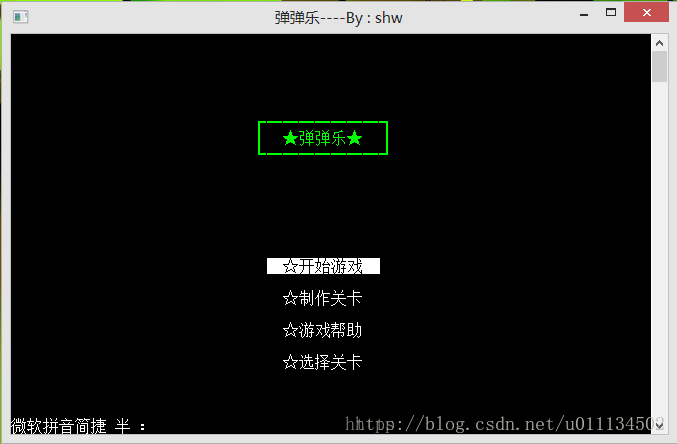
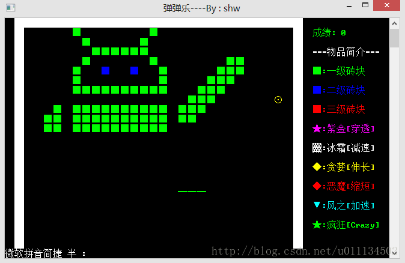
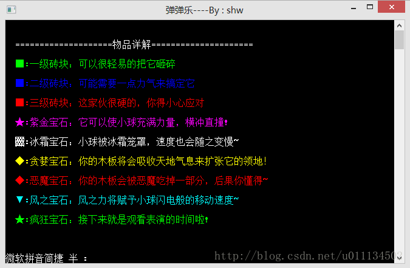
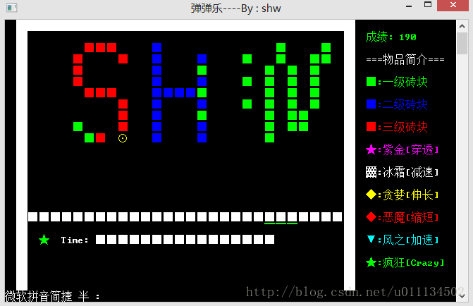
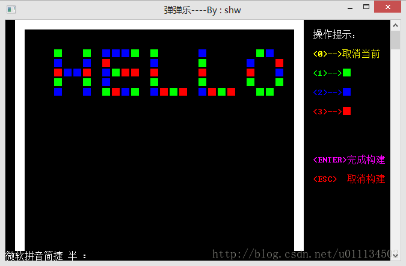

# 弹弹乐
一款类似打砖块的C语言控制台游戏

自从学习了C语言，总想着写点好玩的东西出来，由于我个人比较喜欢玩有戏，所以对写一款好玩的游戏已经心慕已久。

这次花费了一个月左右的时间用纯C语言写了一个我比较喜欢的一款游戏《弹弹乐》出来，在这里分享给大家吐舌头，希望能给大家的学习C语言写游戏提供一点点的帮助！😄

这个游戏和我们熟知的打砖块大同小异，这里我把加入了各种不同的宝石，如果获取到宝石便可以得到不同的能力，比如穿透、减速、板增长，缩短，还有我最喜欢的疯狂模式！而且增加了制作地图，选择地图的功能。

**菜单界面**

**游戏界面**

**帮助界面**

**宝石特效界面**

**制作地图界面**
